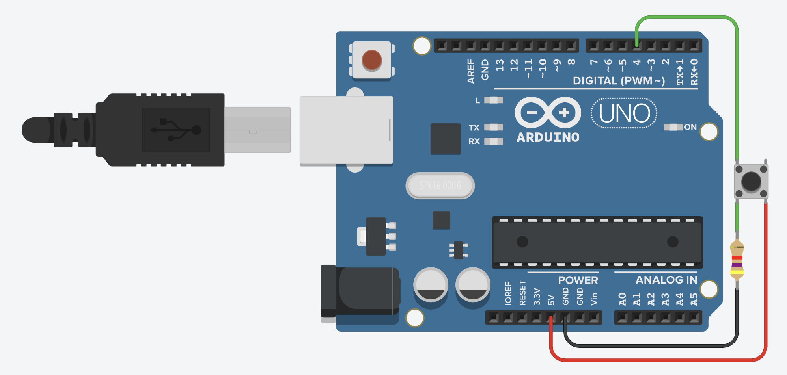

# buttonArduinoToMaya
Press button for change scale to driven object

## Ressources :
__main.ino__ : is the code to upload inside the Arduino
__mayaCommand.py__ : open command port inside the maya scene for give access to the datas from arduino
__arduinoToMaya.py__ : it's python code for open and connect the serial port between arduino and maya

## How it work :
Upload the code main.ino to the arduino.
Execute mayaCommand.py inside maya.
Execute python script arduinoToMaya inside one terminal for launch the transfert of datas

## Montage :

